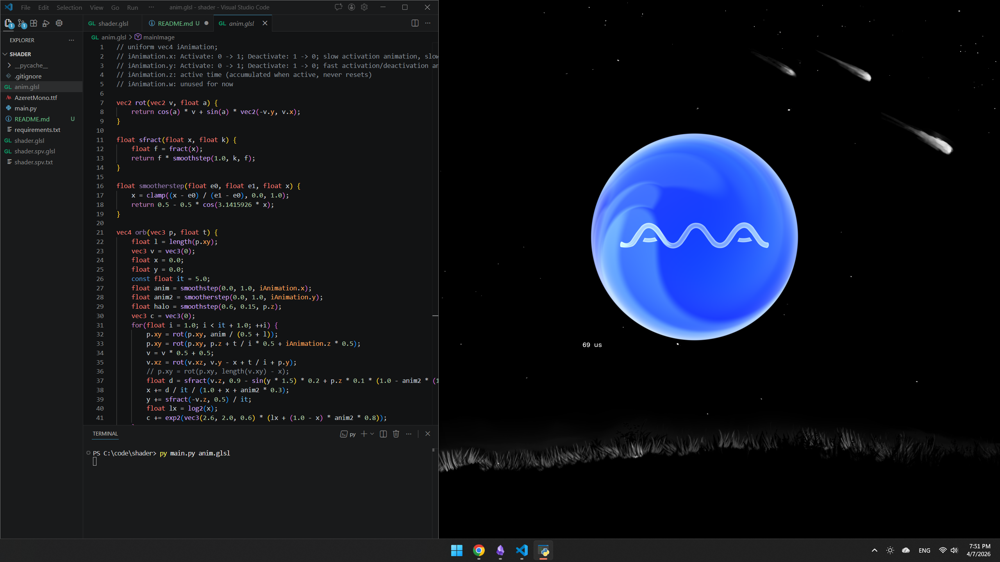

### Shadertoy Runner

runs `.glsl` file with shadertoy and displays as transparent overlay with hot reloading

### Usage

```bash
pip install -r requirements.txt
py main.py shader.glsl
```

### Controls

- `ESC` quit
- `SPACE` pause
- `Drag (LMB)` moves window
- `T` toggle always-on-top
- `D` draw debug timing overlay
- `A` toggle animation active/inactive state



### Notes

- supports uniforms `iTime, iResolution, iTime, iMouse`
- commented out code that also output `shader.spv`
